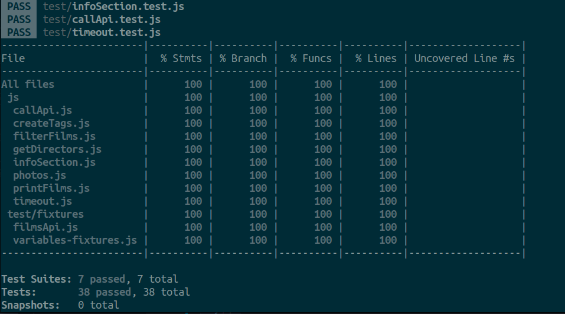
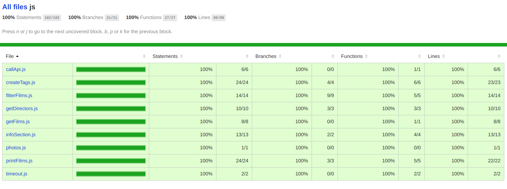

# ghibli-films

Buscador de películas del Estudio Ghibli interactivo usando JavaScript vanilla, CSS y HTML5,

El ejercicio consiste en desarrollar una web de búsqueda de películas del Estudio Ghibli, donde podemos filtrar por nombre, descripción y por director.

Al cargar, nuestra página debe conectarse a la API abierta de [películas de Ghibli](https://ghibliapi.herokuapp.com/). 
Por cada película se pinta una tarjeta donde mostramos una imagen de la serie, el título y la descripción de la película.

La descripción de la película está oculta y no se muestra hasta que el usuario hace click sobre el título "description".


## Testing con Jest

- test unitarios (testear un único componente)
- test integracion (que varios componentes funcionen bien entre ellos)
- test end to end (que demuestre el funcionamiento completo de todo el flujo de la aplicación)

## Instalación de Jest

Documentación oficial: https://jestjs.io/docs/en/getting-started;

Crear un package.json para cofigurar jest:

`$ npm init`

Instalar jest en el repositorio:

` $ npm install --save-dev jest`

Añadir al `.gitignore` la carpeta `node_modules` y `coverage`:

```js
// Node Modules Folder
node_modules

// Visual Code Folder
.vscode

// Jest coverage
coverage
```

Añadir babel para transpilar el código ECMASCRIPT 6:

`$ npm install --dev babel-jest @babel/core @babel/preset-env`

Añadir un archivo de configuración de babel `.babelrc`:

```js
{
  "presets": [
    [
  "@babel/preset-env",
      {
  "targets": {
  "node": "current"
        }
      }
    ]
  ]
}
```

Configurar el `package.json` para utilizar jest:
```js
"scripts": {
    "test": "jest",
    "test:watch": "jest --watch",
    "test:debug": "node --inspect-brk node_modules/.bin/jest --runInBand",
    "test:coverage": "jest --collect-coverage"
},
```

Añadir la librería [jest-fetch-mock](https://www.npmjs.com/package/jest-fetch-mock#simple-mock-and-assert)
para manejar los fetch en los test:

`$ npm install --save-dev jest-fetch-mock`

Creamos un archivo de configuración `setupJest.js`:

```js
//setupJest.js or similar file
global.fetch = require('jest-fetch-mock')
```
Y añadimos al package.json la siguiente configuración:
```js
"jest": {
  "automock": false,
  "setupFiles": [
    "./setupJest.js"
  ]
}
```

## Uso de Jest

Para arrancar los test lanzar el comando:

`$ npm run test`

para ver los cambios en los test de forma continua:

`$ npm run test:watch` 

para ver la cobertura de nuestros tests:

`$ npm run test:coverage` 

Al lanzar este comando, se genera una carpeta coverage, donde en la carpeta `lcov-report` podemos abrir el archivo `index.html` para ver la covertura de nuestros test en el código.

### Resultado de la cobertura en el terminal


### Resultado de la cobertura en el navegador



